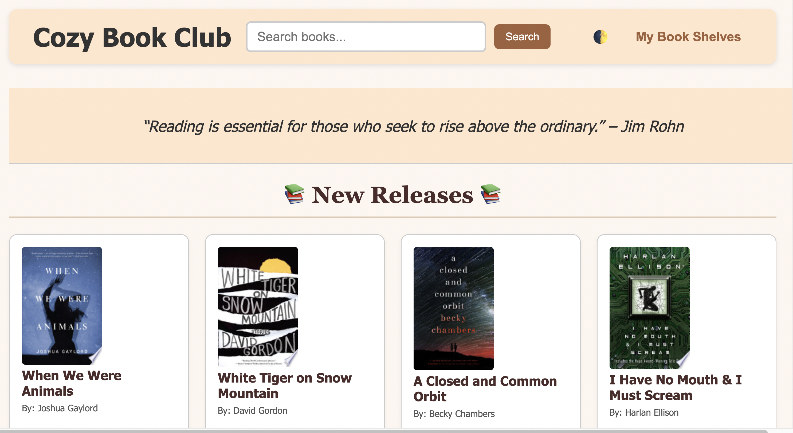
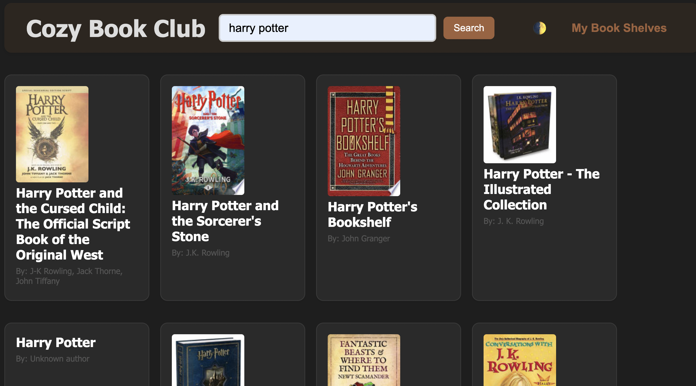
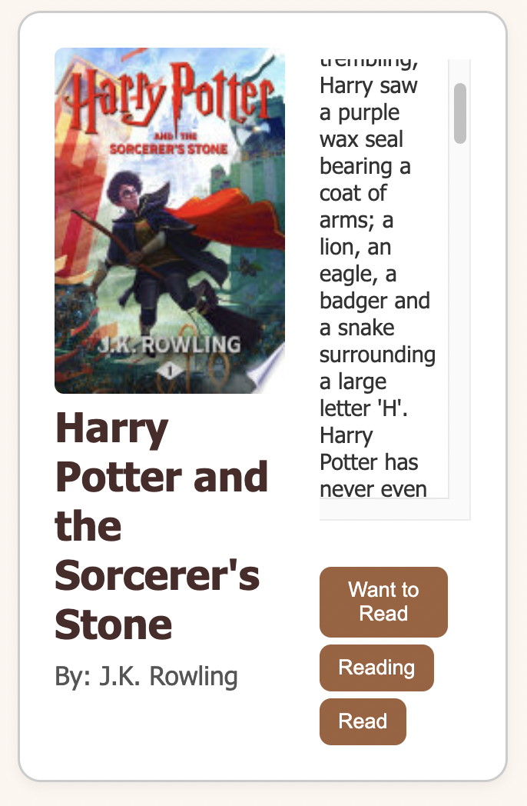
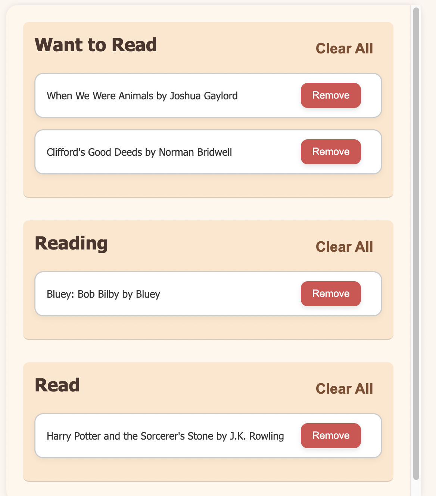

# Cozy Book Club
A simple, responsive web app that lets you search Google Books, browse new releases, and organize your “Want to Read” / “Reading” / “Read” shelves in-browser via localStorage.

## Table of Contents
1. [Features](#features)  
2. [Tech Stack](#tech-stack)  
3. [Screenshots](#screenshots)  
4. [Future Improvements](#future-improvements) 
5. [Deployment](#deployment)
6. [Questions](#questions)

##  Features 

- **Search**: lookup books by title, author, keyword.
- **Shelves**:  
  - Want to Read  
  - Reading  
  - Read  
- **LocalStorage** persistence for your shelves  
- **“Clear All”** button on each shelf  
- **New Releases** section (8 latest fiction titles)  
- **Quote banner** that rotates inspirational reading quotes  
- **Dark / Light** theme toggle  
- **Responsive** – mobile-friendly layouts and modal.

## Tech Stack

- **Vanilla JavaScript**  
- **HTML** + **CSS** 
- **Google Books API**  
- **LocalStorage** for persisting shelves 

## Screenshots

## Future Improvements 
- **Add user accounts & sync shelves to a backend**
- **Book detail pages (with ratings, reviews, etc.)**
- **Filter & sort options within shelves**  

## Deployment
https://brenda255.github.io/cozy-book-club/ 

## Questions
You can contact me with any questions below! 

GitHub: https://github.com/brenda255 
